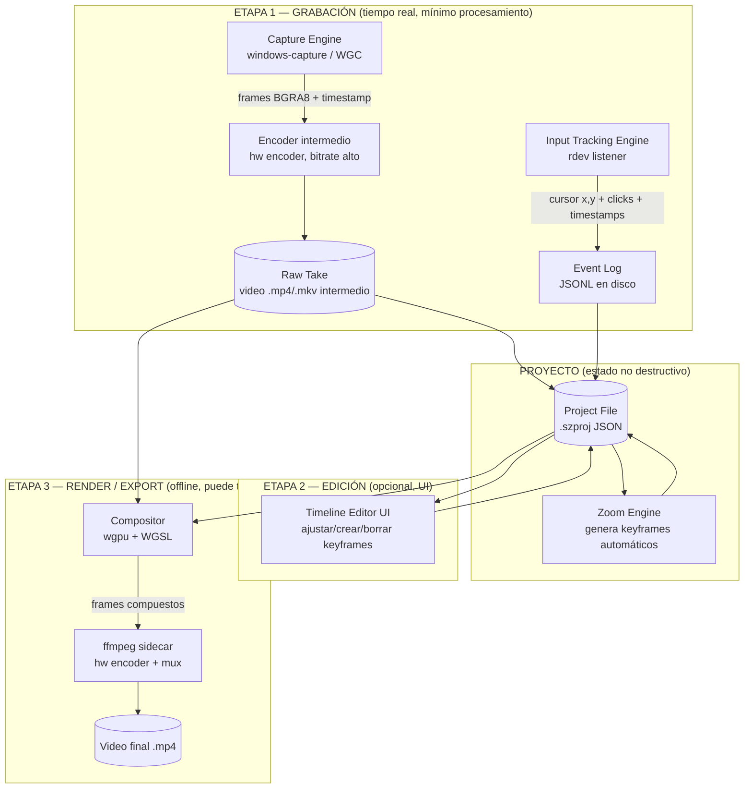

# ARQUITECTURA.md

## Screen Recorder con Zoom Automático — Documento de Arquitectura Técnica

> Placeholder de nombre de producto: **screenzoom** (usado en rutas, paquetes y nombres de crates). El nombre final del producto queda como **PENDIENTE DE DECISIÓN** — reemplazar por búsqueda y reemplazo antes de iniciar el desarrollo real.

> Alcance: Windows primero (MVP), macOS después (fase de expansión). Uso personal inicialmente, sin modelo de negocio definido todavía. App 100% local/offline en el MVP, sin backend propio.

---

## 0. Resumen ejecutivo

| Decisión                                | Resultado                                                                                                                                                                        |
| --------------------------------------- | -------------------------------------------------------------------------------------------------------------------------------------------------------------------------------- |
| Framework de escritorio                 | **Tauri v2** (Rust + WebView nativo), no Electron                                                                                                                                |
| Lenguaje del core                       | **Rust** (captura, tracking, zoom, render, export)                                                                                                                               |
| UI                                      | **React + TypeScript + Tailwind**, corriendo en el WebView de Tauri                                                                                                              |
| Captura de pantalla (Windows)           | **Windows.Graphics.Capture** vía crate `windows-capture`                                                                                                                         |
| Tracking de cursor/clicks               | **rdev** (cross-platform) con posibilidad de upgrade a hook nativo `WH_MOUSE_LL` si hace falta más precisión                                                                     |
| Motor de composición/render             | **wgpu** (WGSL shaders), GPU-accelerated, cross-platform (DX12 en Windows, Metal en Mac a futuro)                                                                                |
| Encoding final                          | **ffmpeg** como sidecar de Tauri, con encoder de hardware (NVENC/Media Foundation/AMF) y fallback por software                                                                   |
| Modelo de edición                       | **No destructivo**: se graba una toma cruda + un log de eventos de input; el zoom se calcula y renderiza en el momento de exportar (igual que Screen Studio y Cap "Studio Mode") |
| Backend / licensing / cuenta de usuario | **Ninguno en el MVP** — app 100% local. PENDIENTE DE DECISIÓN si en el futuro se comercializa                                                                                    |

Esta decisión no es una lista de opciones: es la que se implementa. Cualquier cambio de stack a mitad de proyecto tiene un costo alto y debe ser una decisión consciente, no una improvisación del agente que implementa.

---

## 1. Research competitivo

### 1.1 Cap (open source, la referencia más cercana a este proyecto)

Cap es el caso de estudio más relevante porque resuelve el mismo problema (screen recording "prosumer" con zoom/edición) en **Windows y macOS simultáneamente**, y es open source, así que su arquitectura es pública.

Hallazgos clave:

- Es un monorepo (Turborepo) que separa estrictamente la app de escritorio (Tauri v2) del resto de la infraestructura (web app en Next.js, servidor de medios, extensión de Chrome).
- El pipeline de grabación está construido **enteramente en crates de Rust**, cada uno con una responsabilidad aislada: captura de pantalla, manejo de cámara, mezcla de audio, conversión de frames acelerada por GPU con shaders WGSL propios, muxing, encoding, y subida de chunks. Esto valida directamente la separación en crates que proponemos en la sección 5.
- Tienen dos modos de operación: un modo "instantáneo" que sube mientras graba (pensado para compartir por link, no nos interesa para este proyecto) y un **"Studio Mode"** que procesa todo localmente, con encoding en Rust para mantener los tiempos de render bajos, e incluye zoom/pan editable después de grabar. Este es el modo que replicamos.
- Usan Tauri explícitamente para evitar "el overhead de Electron", con foco en bajo uso de CPU y arranque rápido.

Conclusión: el enfoque "Rust para todo lo que toca performance, web para la UI, non-destructive editing sobre una toma cruda" no es una apuesta arriesgada — es el patrón que ya usa el competidor open source más comparable a este proyecto.

### 1.2 Screen Studio (referencia de producto/UX, no de stack — es Mac-only)

Screen Studio es el estándar de calidad visual al que apuntamos ("nivel DIOS" en tus palabras), pero técnicamente **no es portable**: está construido sobre Metal (gráficos), AVFoundation (captura) y el stack Cocoa de Apple para el editor. Es exclusivamente Mac desde 2022 y no hay fecha pública de una versión Windows — la razón oficial es que portarlo implicaría una reescritura completa, no un port incremental.

Lo que sí es replicable (y es lo que realmente importa) es su **modelo de datos y su approach de rendering**, no su stack:

- El cursor real (jittery, humano) **no se graba tal cual en el video final**. Se ignora la posición de píxeles del cursor renderizada por el SO y en su lugar se reconstruye digitalmente a partir de la posición lógica capturada, generando un movimiento suave y recto entre puntos.
- La posición de clicks se guarda **separada de los frames de video** como metadata. Esto es lo que permite: (a) aplicar zoom automático sin haber definido manualmente el punto de zoom, (b) cambiar el tamaño/visibilidad del cursor después de grabar, y (c) renderizar animaciones anti-aliased de alta calidad en vez de un overlay en tiempo real de baja calidad.
- El efecto de "vidrio" final combina zoom + easing + motion blur aplicado en el render, no en tiempo real durante la captura.

Esto confirma la decisión arquitectónica más importante de este documento: **separar completamente la captura (rápida, sin procesamiento) del render (lento, de alta calidad, no bloqueante)**.

### 1.3 Screenity

Es una extensión de navegador (Chrome), construida sobre APIs web estándar (`getDisplayMedia` + `MediaRecorder`). Técnicamente es la opción más simple y más limitada de las cuatro: corre en el sandbox del navegador, no tiene acceso a APIs nativas de captura de alto rendimiento, y no puede ofrecer el nivel de control de frame-timing, GPU compositing o hardware encoding que buscamos. Es útil como referencia de "qué NO hacer" si el objetivo es calidad prosumer — confirma por descarte que necesitamos una app nativa, no una extensión de navegador ni un wrapper web puro.

### 1.4 ScreenFlow

Es un editor de video Mac-only, más orientado a edición completa tipo NLE (timeline multi-pista, transiciones, texto) que a "auto-zoom inteligente". Es un producto maduro construido sobre el stack nativo de Apple (Cocoa/AVFoundation), sin zoom automático basado en tracking de cursor como diferencial central — su fortaleza es la edición manual completa, no la automatización. No aporta un patrón técnico nuevo respecto a Screen Studio para los fines de este documento; se menciona por completitud del research pedido.

### 1.5 Conclusión del research

Ningún competidor relevante usa Electron para la parte de captura/render. Los dos approaches válidos que existen en el mercado son: (a) nativo puro por plataforma (Screen Studio, Mac-only, no portable) o (b) Rust nativo + shell Tauri con UI web (Cap, cross-platform). Dado que priorizás performance "nivel DIOS" y estás dispuesto a aprender Rust, y que el objetivo es Windows-primero-Mac-después, la opción (b) es la única que cumple ambos requisitos a la vez.

---

## 2. Decisión de stack (fundamentada, sin dejar opciones abiertas)

### 2.1 Electron vs. Tauri — tabla de trade-offs

| Criterio                                                  | Electron                                                                                                    | Tauri v2                                                                                                                                                                      | Ganador                                                            |
| --------------------------------------------------------- | ----------------------------------------------------------------------------------------------------------- | ----------------------------------------------------------------------------------------------------------------------------------------------------------------------------- | ------------------------------------------------------------------ |
| Motor de renderizado UI                                   | Chromium embebido (~150-200MB por app)                                                                      | WebView nativo del SO (WebView2 en Windows, WKWebView en Mac)                                                                                                                 | Tauri (bundle 10-20x más chico)                                    |
| Acceso a APIs nativas de captura (WGC, ScreenCaptureKit)  | Requiere módulos nativos en C++/N-API, integración incómoda                                                 | Acceso directo desde Rust vía crates (`windows-capture`, `screencapturekit-rs`), sin capas intermedias                                                                        | Tauri                                                              |
| Procesamiento de video pesado (GPU compositing, encoding) | JS/Node no es apto; requiere spawnear procesos nativos igual, perdiendo la ventaja de "todo en un lenguaje" | Rust es el lenguaje nativo de la app — el mismo proceso que compone la UI puede hacer el trabajo pesado en threads separados sin cruzar fronteras de proceso innecesariamente | Tauri                                                              |
| Consumo de RAM/CPU en reposo                              | Alto (proceso Chromium completo)                                                                            | Bajo (WebView del sistema + runtime Rust)                                                                                                                                     | Tauri                                                              |
| Madurez del ecosistema de plugins (auto-update, tray, fs) | Muy maduro, años de código de terceros                                                                      | Maduro en v2 (updater, sidecar, fs, dialog — todos con plugin oficial), pero con menos código de terceros que Electron                                                        | Electron (ligeramente), no es bloqueante                           |
| Curva de aprendizaje                                      | Baja si ya sabés JS/TS                                                                                      | Requiere Rust para el core — mayor curva inicial                                                                                                                              | Electron (pero vos ya dijiste que no es un problema aprender Rust) |
| Precedente competitivo directo                            | Ninguno de los competidores serios lo usa para el pipeline de video                                         | Cap (el más comparable) lo usa exactamente así                                                                                                                                | Tauri                                                              |

**Decisión: Tauri v2.** Iosono Mauri mencionó Electron como base, pero el research de mercado no lo respalda para este tipo de producto — ningún competidor que resuelve este problema específico (captura + zoom + render de alta calidad) usa Electron para esa parte. Dado que vos priorizás "nivel DIOS" de rendimiento por sobre velocidad de desarrollo con un stack conocido, Tauri + Rust es la decisión correcta, no una entre varias igualmente válidas.

### 2.2 ¿Por qué no nativo puro (Swift/C++ + Win32/UWP)?

Porque el objetivo es Windows primero y Mac después, y un desarrollo 100% nativo por plataforma implica **dos bases de código separadas** para UI y lógica de negocio (solo el core de captura debería diferir). Rust + Tauri nos da: un solo lenguaje para toda la lógica pesada (compartido entre plataformas detrás de un trait de captura), y una sola base de UI (React) para ambas plataformas. La única parte verdaderamente nativa por plataforma es la implementación concreta de captura de pantalla (`windows-capture` en Windows, `screencapturekit-rs` en Mac más adelante), que queda aislada detrás de una interfaz común (ver sección 3.2).

### 2.3 Elección de librerías core (decididas, no opcionales)

| Necesidad                        | Librería/crate elegido                                                                    | Alternativas descartadas y por qué                                                                                                                                                                                                                                                                                                               |
| -------------------------------- | ----------------------------------------------------------------------------------------- | ------------------------------------------------------------------------------------------------------------------------------------------------------------------------------------------------------------------------------------------------------------------------------------------------------------------------------------------------ |
| Captura de pantalla Windows      | `windows-capture` (envuelve Windows.Graphics.Capture + fallback DXGI Desktop Duplication) | `scap` (cross-platform genérico): más cómodo pero menos control fino sobre timing de frames y cursor capture settings, que es exactamente lo que necesitamos afinar para "nivel DIOS". Se usa como referencia de diseño, no como dependencia.                                                                                                    |
| Tracking global de mouse/teclado | `rdev`                                                                                    | Hooks nativos manuales vía `windows-rs` (`SetWindowsHookEx`): más control y menor latencia potencial, pero mucho más código y no cross-platform. Se deja como **upgrade path documentado**, no como decisión inicial — empezamos con `rdev` porque es cross-platform (nos sirve también para la fase Mac) y reduce superficie de bugs en el MVP. |
| Compositing/render GPU           | `wgpu` (WGSL)                                                                             | OpenGL directo: wgpu es el estándar moderno en Rust, cross-platform real (Vulkan/DX12/Metal), y es literalmente lo que usa Cap para su pipeline de conversión de frames. No hay razón para reinventar esto.                                                                                                                                      |
| Encoding final                   | `ffmpeg` bundleado como **sidecar de Tauri**                                              | Wrapper Rust de Media Foundation/NVENC directo: más "puro" pero reinventa algo que ffmpeg ya resuelve de forma robusta y probada en producción por miles de apps. El costo (tamaño del binario bundleado, ~40-80MB) es aceptable para un producto de escritorio prosumer.                                                                        |
| Auto-update                      | `tauri-plugin-updater` (oficial)                                                          | Nada custom — es exactamente para esto que existe el plugin oficial, con firma criptográfica de releases incluida.                                                                                                                                                                                                                               |

---

## 3. Arquitectura técnica completa

### 3.1 Principio rector: capturar rápido, componer después

La captura NUNCA debe hacer trabajo pesado (zoom, easing, composición). Su único trabajo es: leer frames de la API nativa y escribirlos a disco lo más rápido posible, en paralelo con loguear eventos de input con timestamps. Todo el trabajo "caro" (zoom automático, easing, composición GPU, cursor reconstruido, encoding final) pasa en la etapa de **render/export**, que corre después de terminar de grabar (o en background mientras heurísticamente el usuario revisa la toma). Esto es exactamente el patrón validado en la sección 1.2.

### 3.2 Diagrama de flujo de datos



### 3.3 Módulos del sistema

| Módulo                       | Responsabilidad                                                                                                                                                             | Dónde corre                                                                            | Lenguaje                                    |
| ---------------------------- | --------------------------------------------------------------------------------------------------------------------------------------------------------------------------- | -------------------------------------------------------------------------------------- | ------------------------------------------- |
| **Capture Engine**           | Captura frames de pantalla vía API nativa, los pasa a un encoder de hardware, escribe la "toma cruda" a disco                                                               | Thread dedicado (tokio blocking task), nunca el hilo de UI                             | Rust (`crates/capture`)                     |
| **Input Tracking Engine**    | Escucha eventos globales de mouse/teclado, los timestampea contra el mismo reloj monótono que la captura, los escribe a un log                                              | Thread dedicado, en paralelo a la captura                                              | Rust (`crates/input-tracker`)               |
| **Project Store**            | Serializa/deserializa el archivo de proyecto (referencia a la toma cruda + event log + keyframes de zoom + settings)                                                        | Cualquier thread, acceso vía comandos Tauri                                            | Rust (`crates/project`)                     |
| **Zoom/Easing Engine**       | Analiza el event log, detecta puntos de interés (clusters de clicks, ráfagas de tipeo, inactividad), genera keyframes de zoom automáticos con curva de easing configurable  | Se invoca on-demand (al terminar de grabar), lógica pura, 100% testeable sin UI ni GPU | Rust (`crates/zoom-engine`)                 |
| **Compositor/Render Engine** | Decodifica la toma cruda, interpola la "cámara" (rect de crop/zoom) para cada frame de salida, renderiza cursor reconstruido, aplica fondo/padding/motion blur, todo en GPU | Thread/proceso dedicado, se reporta progreso vía eventos Tauri                         | Rust + wgpu/WGSL (`crates/compositor`)      |
| **Exporter**                 | Recibe frames ya compuestos, los pipea a ffmpeg (sidecar) para encoding final y muxing de audio                                                                             | Proceso hijo (sidecar), comunicación vía pipe                                          | Rust (`crates/exporter`) + binario `ffmpeg` |
| **UI Layer**                 | Controles de grabación, selector de fuente/monitor, editor de timeline, preview, configuración de export                                                                    | WebView de Tauri                                                                       | React + TypeScript + Tailwind               |
| **Tauri Bridge**             | Expone comandos (`invoke`) y eventos (progreso de render, tiempo de grabación) entre Rust y la UI                                                                           | Proceso principal de Tauri                                                             | Rust (`apps/desktop/src-tauri`)             |
| **Auto-update**              | Verifica y aplica actualizaciones de la app                                                                                                                                 | Plugin oficial                                                                         | `tauri-plugin-updater`                      |

### 3.4 Comunicación entre módulos

- La UI **nunca** llama directamente a `windows-capture`, `wgpu` ni `ffmpeg`. Todo pasa por **comandos Tauri** (`#[tauri::command]`) que delegan a los crates de `crates/`.
- El progreso de operaciones largas (grabación en curso, render en curso, export en curso) se comunica de la UI hacia atrás **no por polling**, sino por **eventos Tauri** (`app.emit(...)` desde Rust, `listen(...)` en el frontend) — así la UI se actualiza en tiempo real sin bloquear nada.
- Los crates de `crates/` son **agnósticos de Tauri**: no importan `tauri` como dependencia. Esto permite testearlos con `cargo test` puro y reusarlos si el día de mañana se decide hacer una versión CLI o headless. La capa `src-tauri/src/commands/` es la única que conoce Tauri y actúa de adaptador.

### 3.5 Modelo de datos: el archivo de proyecto (`.szproj`)

Es el corazón del modelo no-destructivo. Un ejemplo simplificado:

```json
{
  "version": 1,
  "raw_take": {
    "path": "takes/take_2026-08-14T10-00-00.mp4",
    "fps": 60,
    "resolution": { "width": 3840, "height": 2160 },
    "duration_ms": 125000
  },
  "input_log": {
    "path": "takes/take_2026-08-14T10-00-00.input.jsonl"
  },
  "zoom_keyframes": [
    {
      "id": "kf_001",
      "start_ms": 3200,
      "duration_ms": 600,
      "target_rect": { "x": 0.42, "y": 0.31, "w": 0.35, "h": 0.35 },
      "easing": "ease-in-out-cubic",
      "source": "auto"
    }
  ],
  "style": {
    "background": "gradient-01",
    "padding": 0.06,
    "corner_radius": 18,
    "shadow": true,
    "cursor_smoothing": true,
    "motion_blur": true
  },
  "export_settings": {
    "resolution": "1080p",
    "fps": 60,
    "codec": "h264",
    "hw_accel": "auto"
  }
}
```

`target_rect` usa coordenadas normalizadas (0-1) para que sea independiente de la resolución de captura vs. la de export. `source: "auto"` marca los keyframes generados automáticamente vs. `"manual"` los editados/creados por el usuario — importante para que el Zoom Engine pueda "re-generar" automáticos sin pisar ediciones manuales si el usuario pide recalcular.

### 3.6 Riesgos técnicos principales y mitigación

| Riesgo                                                                               | Impacto                                                     | Mitigación                                                                                                                                                                                                                 |
| ------------------------------------------------------------------------------------ | ----------------------------------------------------------- | -------------------------------------------------------------------------------------------------------------------------------------------------------------------------------------------------------------------------- |
| Latencia/precisión de `rdev` insuficiente para sincronizar cursor con frames a 60fps | El zoom no sigue exactamente donde clickeó el usuario       | Diseñar el Input Tracking Engine detrás de un trait (`InputSource`) desde el día 1, para poder reemplazar `rdev` por un hook nativo `WH_MOUSE_LL` sin tocar el resto del sistema si hace falta                             |
| Captura a 4K60 satura CPU/RAM si se bufferea todo en memoria                         | Frame drops, crashes en grabaciones largas                  | La captura escribe a disco de forma continua (toma cruda encodeada por hardware), nunca acumula frames crudos en RAM                                                                                                       |
| `wgpu` + WGSL tiene curva de aprendizaje real                                        | Fase de compositor se puede estancar                        | Empezar el compositor con una pipeline mínima (crop + scale, sin motion blur ni cursor reconstruido) en la Fase 1, y sumar efectos incrementalmente en Fase 3                                                              |
| Licencia GPL de `libx264` si se linkea directo                                       | Problema legal si se distribuye comercialmente en el futuro | Bundlear ffmpeg compilado con encoders LGPL-compatible (NVENC/QSV/AMF/Media Foundation + `openh264` como fallback de software), evitando `libx264` salvo que se resuelva explícitamente la licencia comercial más adelante |

---

## 4. Requerimientos funcionales y no funcionales

### 4.1 Funcionales (MVP)

- Grabar pantalla completa o un monitor específico (selector de fuente).
- Grabar audio del sistema y/o micrófono (toggle independiente).
- Detectar clicks y generar zoom automático hacia la zona del click.
- Detectar inactividad y hacer zoom-out automático.
- Editar manualmente los keyframes de zoom generados (mover, redimensionar, borrar, agregar).
- Configurar fondo, padding y esquinas redondeadas del video final.
- Exportar a MP4 (H.264) en 1080p, 1440p o 4K, hasta 60fps.

### 4.2 No funcionales

| Categoría               | Requisito                                                                                                                                       |
| ----------------------- | ----------------------------------------------------------------------------------------------------------------------------------------------- |
| Resoluciones soportadas | Captura hasta 4K (3840×2160); export en 1080p/1440p/4K                                                                                          |
| FPS                     | Captura y export a 30 o 60 fps (60 recomendado por defecto, mejora la fidelidad del zoom/cursor)                                                |
| Formatos de export      | MP4 (H.264 primero; H.265/HEVC como opción de menor tamaño). GIF queda para fases posteriores                                                   |
| CPU durante grabación   | Objetivo: <20% de uso promedio en hardware moderno (gracias a encoding por hardware)                                                            |
| RAM durante grabación   | Acotada y estable independientemente de la duración (sin acumulación de frames en memoria)                                                      |
| Multi-monitor           | MVP: selección de un monitor/fuente por grabación. Captura simultánea de múltiples monitores queda para fases posteriores                       |
| Comportamiento offline  | 100% funcional sin conexión a internet en el MVP (no hay backend)                                                                               |
| Code signing (Windows)  | No necesario para uso personal. **PENDIENTE DE DECISIÓN** si se distribuye a terceros (certificado Authenticode, evita warnings de SmartScreen) |
| Notarización (Mac)      | No aplica hasta la fase de puerto a Mac. **PENDIENTE DE DECISIÓN** cuando llegue esa fase                                                       |
| Auto-update             | Sí, desde el MVP — bajo esfuerzo con `tauri-plugin-updater`, alto valor para iterar rápido en uso personal                                      |

---

## 5. Estructura de proyecto

```
screenzoom/
├── apps/
│   └── desktop/                        # App Tauri (lo único "empaquetable")
│       ├── src/                        # Frontend React + TS
│       │   ├── features/
│       │   │   ├── recording/          # UI de grabación: selector de fuente, botón rec
│       │   │   ├── editor/             # Timeline, keyframes de zoom, preview
│       │   │   └── export/             # Configuración y progreso de export
│       │   ├── components/             # Componentes UI genéricos y reusables
│       │   ├── stores/                 # Estado global (zustand)
│       │   ├── lib/                    # Wrappers tipados de `invoke()` hacia Rust
│       │   ├── styles/
│       │   └── main.tsx
│       ├── src-tauri/                  # Backend Tauri (capa de adaptación, NO lógica pesada)
│       │   ├── src/
│       │   │   ├── main.rs
│       │   │   ├── commands/           # #[tauri::command] — delegan a crates/*
│       │   │   │   ├── recording.rs
│       │   │   │   ├── project.rs
│       │   │   │   └── export.rs
│       │   │   ├── state.rs            # Estado compartido de la app (AppState)
│       │   │   └── events.rs           # Helpers de emisión de eventos al frontend
│       │   ├── capabilities/           # Permisos de Tauri v2 (principio de mínimo privilegio)
│       │   ├── icons/
│       │   ├── Cargo.toml
│       │   └── tauri.conf.json
│       ├── index.html
│       ├── package.json
│       └── vite.config.ts
│
├── crates/                             # Lógica Rust pura, testeable sin Tauri ni UI
│   ├── capture/                        # Trait ScreenCapturer + impl Windows (windows-capture)
│   ├── input-tracker/                  # Trait InputSource + impl rdev
│   ├── zoom-engine/                    # Detección de puntos de interés + generación de keyframes + easing
│   ├── compositor/                     # Render GPU (wgpu/WGSL): crop, cursor, fondo, motion blur
│   ├── exporter/                       # Orquestación del sidecar ffmpeg (encode + mux)
│   └── project/                        # Schema del .szproj (serde), lectura/escritura
│
├── sidecars/
│   └── ffmpeg/                         # Binarios ffmpeg por plataforma (gitignored, se descargan en build)
│
├── docs/
│   └── ARQUITECTURA.md                 # Este documento
│
├── .env.example
├── CLAUDE.md
├── package.json                        # Workspace root (pnpm/npm workspaces)
├── Cargo.toml                          # Workspace root de Rust
└── README.md
```

### Convenciones de nombres

- Carpetas y archivos: `kebab-case`.
- Crates de Rust: `kebab-case`, prefijo implícito por carpeta (no hace falta prefijar `screenzoom-` dentro del workspace).
- Componentes React: `PascalCase.tsx`.
- Comandos Tauri: `snake_case` del lado Rust, se invocan igual desde TS (`invoke("start_recording")`).
- Cada crate en `crates/` expone un único trait público principal (`ScreenCapturer`, `InputSource`, etc.) para que las implementaciones concretas por plataforma sean intercambiables sin tocar el resto del sistema.

---

## 6. Roadmap por fases

### Fase 0 — Spike de riesgo técnico (1-2 semanas)

Objetivo: validar lo más incierto ANTES de construir nada de UI o arquitectura completa.

- Repo scaffold (Tauri + React, workspace de Cargo).
- Spike de captura: grabar pantalla con `windows-capture`, guardar a un mp4 crudo, sin zoom ni UI.
- Spike de input tracking: `rdev` corriendo en paralelo, logueando eventos con timestamps a consola/archivo.
- **Criterio de "listo"**: video de escritorio de 60s a 1080p60 grabado y reproducible en cualquier player, más un log de eventos de mouse con timestamps sincronizados.

### Fase 1 — MVP de grabación + zoom automático (sin editor manual)

- Integrar Capture Engine + Input Tracking Engine + Project Store.
- Zoom Engine v1: reglas simples (zoom-in en clicks, zoom-out tras N segundos de inactividad), una sola curva de easing por defecto.
- Compositor v1: pipeline wgpu mínima (crop + scale, sin motion blur ni cursor reconstruido todavía).
- Exporter: pipe a ffmpeg sidecar, export a MP4.
- UI mínima: botón grabar/detener, selector de monitor, botón exportar. Sin timeline editable.
- **Criterio de "listo"**: grabar una demo de 2-3 minutos y obtener automáticamente un MP4 con zooms in/out siguiendo los clicks, sin intervención manual.

### Fase 2 — Editor post-grabación (el verdadero diferencial del producto)

- Timeline UI: visualizar los keyframes generados, arrastrar/ajustar/eliminar/agregar.
- Selector de curva de easing (mínimo 2-3 presets: linear, ease-in-out, spring).
- Preview en tiempo real de baja resolución, sincronizado con el timeline.
- Configuración de fondo, padding, esquinas redondeadas.
- **Criterio de "listo"**: poder editar manualmente cualquier zoom generado automáticamente y ver el resultado antes de exportar.

### Fase 3 — Pulido "nivel DIOS"

- Motion blur en las transiciones de zoom.
- Reconstrucción de cursor suavizado (no cursor crudo del SO).
- Selección de ventana específica (no solo pantalla completa).
- Auto-update con `tauri-plugin-updater`.
- Manejo robusto de errores/crashes (no perder una grabación si la app crashea a mitad).
- **Criterio de "listo"**: la app es confiable para uso diario propio, sin miedo a perder grabaciones ni resultados con artefactos visuales.

### Fase 4 — Expansión (explícitamente fuera del MVP)

- Puerto a macOS: implementar `ScreenCapturer` con `screencapturekit-rs`, notarización.
- Subtítulos automáticos, transiciones, overlay de webcam, multi-track de audio.
- Export a GIF y otros formatos.
- Licensing/monetización — **PENDIENTE DE DECISIÓN** completa (modelo de negocio, si hay backend, pricing).

---

## 7. Resumen de decisiones PENDIENTES (negocio, no arquitectura)

Estas decisiones NO bloquean el desarrollo del MVP, pero van a impactar arquitectura futura si se resuelven en una dirección u otra:

1. **Modelo de negocio** (pago único / suscripción / freemium / sin monetizar). Si en algún momento se decide suscripción o freemium con features server-side, hay que sumar un backend de auth/billing que hoy NO existe en este diseño.
2. **Code signing de Windows y notarización de Mac** — solo relevantes cuando se distribuya la app a terceros, no para uso personal.
3. **Nombre final del producto** (hoy usamos el placeholder `screenzoom`).
4. **Licencia de distribución del binario de ffmpeg** si el producto se comercializa (evaluar LGPL-only build vs. licencia comercial de MPEG LA si se necesita `libx264`).
